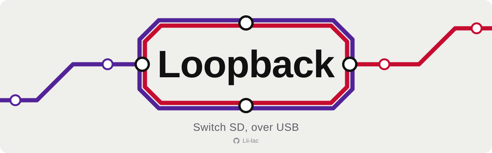
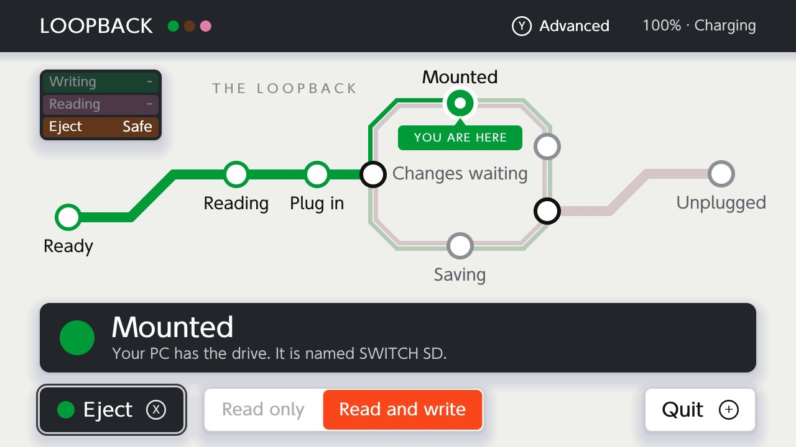
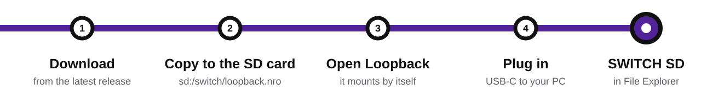
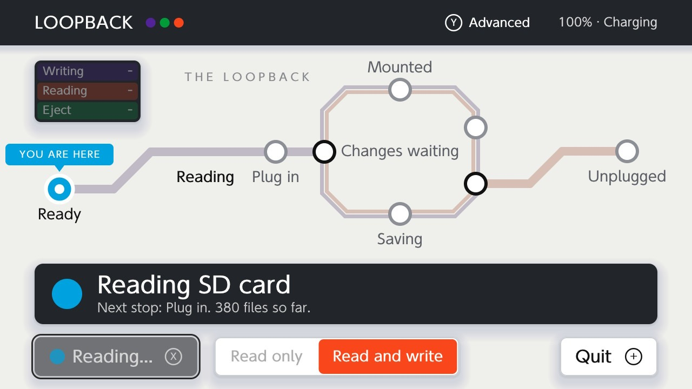
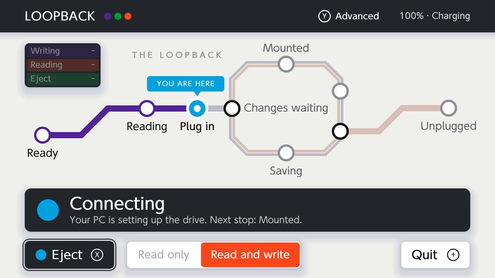
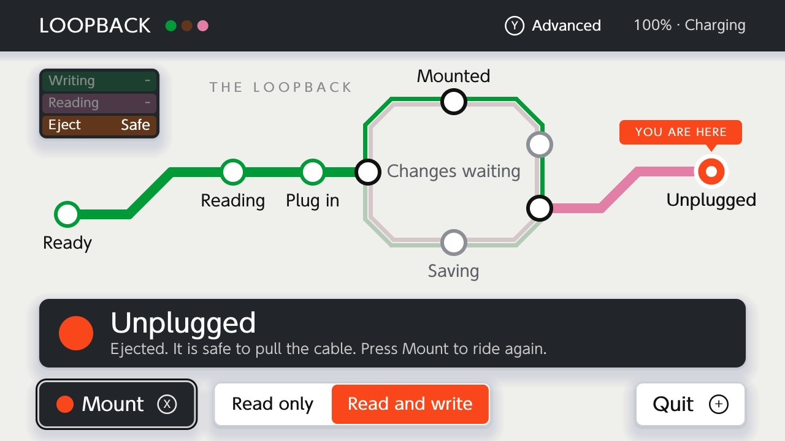

  <picture>
    <source media="(prefers-color-scheme: dark)" srcset="docs/images/banner-dark.svg">
    
  </picture>

  <picture>
    <source media="(prefers-color-scheme: dark)" srcset="docs/images/badge-platform-dark.svg">
    
  </picture>
  <picture>
    <source media="(prefers-color-scheme: dark)" srcset="docs/images/badge-pc-dark.svg">
    
  </picture>
  <a href="LICENSE"><picture>
    <source media="(prefers-color-scheme: dark)" srcset="docs/images/badge-license-dark.svg">
    
  </picture></a>

  <b>Your Switch's SD card as a real drive on your PC.</b> 
  Open Loopback, plug in a USB-C cable, and <code>SWITCH SD</code> shows up in Explorer with its own drive letter. 
  No reboot, no payload, nothing to install on the PC.

  

- **Just a drive.** Drag and drop, right-click, "Open with", Send to, edit a file in place and hit save. Windows thinks it's a USB stick, so anything that can open a file can open one on your card.
- **Fast.** Around 35 MB/s each way on USB 2. USB 3 speeds are untested.
- **No driver, no PC software.** It uses the mass storage support that's already in Windows.
- **Half a copy never lands.** Your PC's changes are held aside and applied to the card all at once, so if you pull the cable mid-copy, the card stays as it was.
- **Stays out of your way.** It mounts as soon as it opens, saves a couple of seconds after your PC stops writing, and drops you back in the Homebrew Menu when you quit.
- **Tells you what it's doing.** A small transit map shows where you are: reading the card, waiting for the cable, mounted, saving, unplugged.

<picture>
  <source media="(prefers-color-scheme: dark)" srcset="docs/images/divider-dark.svg">
  
</picture>

## Install

You need a Switch running Atmosphere with the Homebrew Menu, a USB-C cable that carries data, and a Windows 10 or 11 PC.

<picture>
  <source media="(prefers-color-scheme: dark)" srcset="docs/images/route-dark.svg">
  
</picture>

1. Download `loopback.nro` from the [latest release](https://github.com/Lii-lac/loopback-nx/releases/latest). (Want to build it yourself? See [docs/building.md](docs/building.md).)
2. Copy it to `sd:/switch/loopback.nro` on the SD card.
3. Open **Loopback** from the Homebrew Menu. It mounts the card on its own.
4. Plug the Switch into your PC. `SWITCH SD` shows up.

**Safety mode.** By default Loopback mounts as soon as it opens, in Read and write, and saves without asking. If you'd rather it ask first, press `Y`, open **Safety mode** and turn it on. Then it waits for you to press Mount, starts read only, and checks with you before anything risky.

> [!WARNING]
> Back up your SD card before you use this for the first time. By default your PC can change or delete anything on the card without warning. Turn on Safety mode if you want Loopback to ask first.

**Updating:** press `Y`, open **Updates** and check for a newer release. Install it with the drive ejected, then restart Loopback from the same screen. Copying a new `loopback.nro` over `sd:/switch/loopback.nro` works too.

**Home-screen icon (optional):** see [docs/forwarder.md](docs/forwarder.md). It only points at the `.nro`, so you never need a new one when you update the app.

## Using Loopback

Loopback mounts as soon as it opens, so just plug in and work. The map shows where you are, and the caption says what's next.

<table>
<tr>
<td></td>
<td></td>
<td></td>
</tr>
<tr>
<td align="center">Reading the card</td>
<td align="center">Connecting</td>
<td align="center">Ejected</td>
</tr>
</table>

- `X` mounts, and ejects once it's mounted. `R` saves now. `Y` opens Advanced. `+` quits. Touch works too.
- Changes reach the card a couple of seconds after your PC stops writing, or right away when you Safely Remove the drive. If you pull the cable mid-copy, nothing gets saved on its own.
- Files of 4 GiB or more can't be saved, and timestamps aren't kept on files you copy in.

Everything else, including safety mode in full and the known limitations, is in [docs/reference.md](docs/reference.md).

<picture>
  <source media="(prefers-color-scheme: dark)" srcset="docs/images/divider-dark.svg">
  
</picture>

## More

| | |
|---|---|
| [docs/reference.md](docs/reference.md) | Every stop, control and setting, and what to know about saving |
| [docs/forwarder.md](docs/forwarder.md) | The optional Home-screen icon, with no startup logo |
| [docs/building.md](docs/building.md) | Building the `.nro`, running the tests, source layout |
| [docs/how-it-works.md](docs/how-it-works.md) | How a drive is made out of a folder tree, and how PC writes become file changes |

## License

MIT, see [LICENSE](LICENSE). Loopback also includes stb_truetype (public domain or MIT), and is built with libnx, libcurl and zlib. Each keeps its own license.
